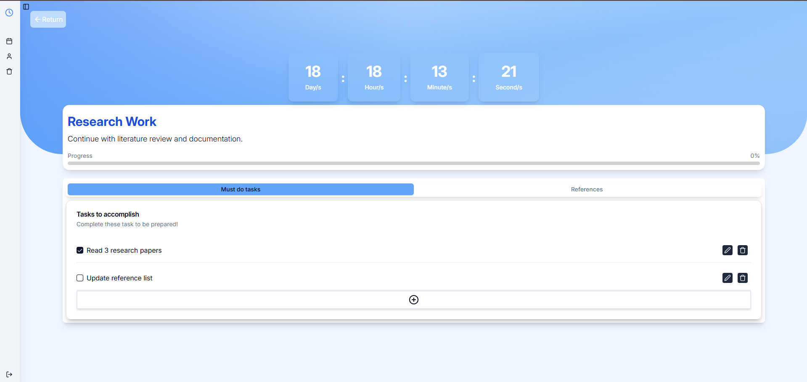

# PrepPulse

PrepPulse is a full-stack application designed to help users manage and prepare for their schedules and tasks effectively. It offers a user-friendly interface to organize, track, and get ready for upcoming commitments.

## Screenshots




## Prerequisites

Before you begin, ensure you have the following installed:

- [Node.js](https://nodejs.org/) (LTS version recommended)
- [pnpm](https://pnpm.io/installation)
- [Docker](https://www.docker.com/products/docker-desktop/) (for backend services)

## Setup and Installation

1.  **Clone the repository:**

    ```bash
    git clone https://github.com/RigelKukoy/PrepPulse.git
    cd PrepPulse
    ```

2.  **Install root dependencies:**

    ```bash
    pnpm install
    ```

3.  **Install Frontend dependencies:**

    ```bash
    cd Frontend
    pnpm install
    cd ..
    ```

4.  **Install Backend dependencies:**
    ```bash
    cd Backend
    pnpm install
    cd ..
    ```

## Running the Application

It's generally recommended to start services in separate terminal windows/tabs.

1.  **Start Backend Services (including Database via Docker):**
    Navigate to the `Backend` directory and run the development script. This will also start any services defined in `docker-compose.yml` (like your PostgreSQL database).

    ```bash
    cd Backend
    pnpm run dev
    ```

    Alternatively, if you want to start only the Node.js server (assuming Docker services are already running or managed separately):

    ```bash
    cd Backend
    pnpm start
    ```

2.  **Start the Frontend Development Server:**
    Navigate to the `Frontend` directory and run the development script.
    ```bash
    cd Frontend
    pnpm run dev
    ```

Once all services are running, you should be able to access the application. Vite typically runs on port `5173` by default. Check your terminal output for the exact port.

- Frontend: [http://localhost:5173](http://localhost:5173) (or the port specified in your Vite config/terminal output)
- Backend API: (Usually runs on a different port, e.g., 5000, as configured in your backend)
